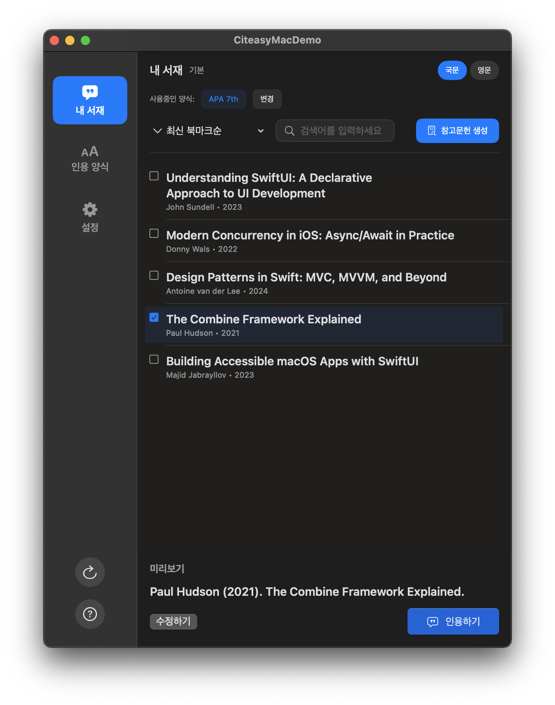

# Citeasy Mac Demo

SwiftUI 기반의 macOS용 싸이티지 데모 애플리케이션입니다.  
Windows 앱 '싸이티지'의 일부 기능을 macOS 환경에서 재현한 포트폴리오 프로젝트입니다.

## ✨ 주요 기능

- [x] macOS용 SwiftUI 기반 UI 구현
- [x] 인용하기 기능 (Pages 연동)

## 📽️ 시연 영상

> 클릭하면 유튜브에서 인용 기능 시연 영상을 확인할 수 있습니다.

## 🛠️ 기술 스택

- SwiftUI
- AppKit 연동 (Pages 인용기능)
- macOS 13+ 지원

